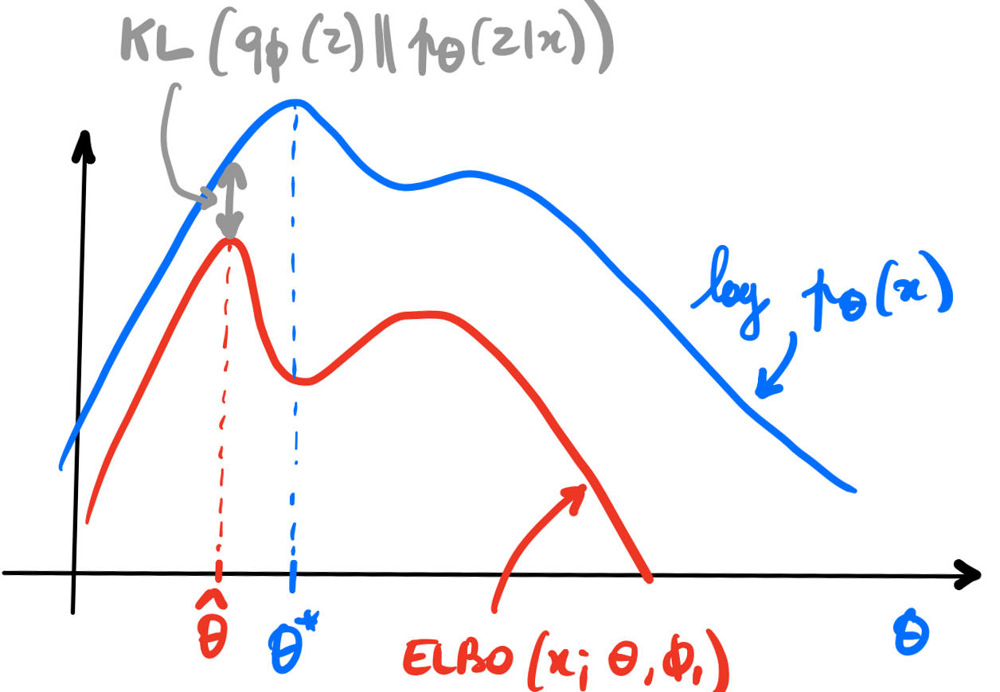
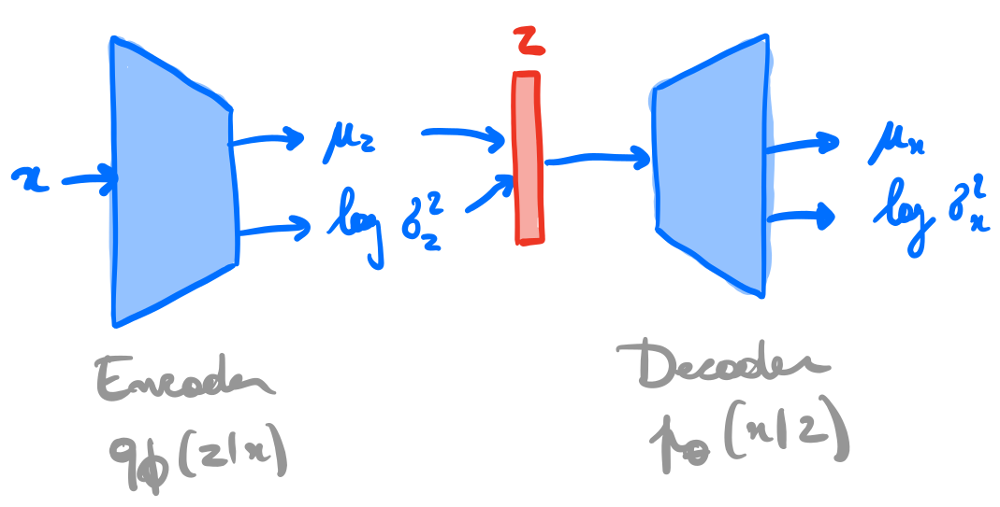

class: middle, center, title-slide

# Deep generative models
.italic[A latent variable model perspective]

 

51st SLAC Summer Institute

August 15, 2023

 

Gilles Louppe 
[g.louppe@uliege.be](mailto:g.louppe@uliege.be)

---

# Outline

1. Deep generative models
2. Variational auto-encoders
3. Diffusion models
4. Normalizing flows

---

count: false
class: middle

# Deep generative models

---

class: middle

## Generative models

A (deep) **generative model** is a probabilistic model $p\_\theta$ that can be used as a simulator of the data. 

Formally, a generative model defines a probability distribution $p\_\theta(\mathbf{x})$ over the data $\mathbf{x} \in \mathcal{X}$, parameterized by $\theta$. 

.center.width-60[]

???

Our goal is to learn $\theta$ to match the (unknown) data distribution $p(\mathbf{x})$.

---

class: middle, black-slide

.grid[
.kol-1-2.center[
.width-80[]
]
.kol-1-2.center[
 
.width-75[]
]
]
.grid[
.kol-1-2.center[

Variational auto-encoders  (Kingma and Welling, 2013)

]
.kol-1-2.center[

Diffusion models 
(Midjourney, 2023)

]
]

---

class: black-slide
background-image: url(./figures/landscape.png)
background-size: contain

.footnote[Credits: [Karsten et al](https://cvpr2022-tutorial-diffusion-models.github.io/), 2022; [Siddharth Mishra-Sharma](https://smsharma.io/iaifi-summer-school-2023/), 2023.]

---

class: middle

## Simulators

A simulator prescribes a generative model that can be used to simulate data $\mathbf{x}$. 

.center.width-100[]

.footnote[Credits: [Siddharth Mishra-Sharma](https://smsharma.io/iaifi-summer-school-2023/), 2023.]

---

class: middle

## Conditional simulators

A conditional simulator prescribes a way to sample from the likelihood $p(\mathbf{x}|\vartheta)$, where $\vartheta$ is a set of conditioning variables or parameters.

.center.width-100[]

.footnote[Credits: [Siddharth Mishra-Sharma](https://smsharma.io/iaifi-summer-school-2023/), 2023.]

---

class: middle

$$p(z\_p|\vartheta)$$

.width-100[]

???

generation: pencil and paper calculable from first principles

---

count: false
class: middle

$$p(z\_s|\vartheta) = \int p(z\_p|\vartheta) p(z\_s | z\_p) dz\_p$$

.width-100[]

???

parton shower + hadronization: controlled approximation of first principles + phenomenological model

---

count: false
class: middle

$$p(z\_d|\vartheta) = \iint p(z\_p|\vartheta) p(z\_s | z\_p) p(z\_d | z\_s) dz\_p dz\_s$$

.width-100[]

???

detector simulation: interaction with the materials and digitization

---

count: false
class: middle

$$p(x|\vartheta) = \iiint p(z\_p|\vartheta) p(z\_s | z\_p) p(z\_d | z\_s) p(x|z\_d) dz\_p dz\_s dx$$

.width-100[]

???

reconstruction simulation

---

class: middle

## What can we do with generative models?

.grid[
.kol-1-3.center[

Produce samples $$\mathbf{x} \sim p(\mathbf{x} | \vartheta)$$

]
.kol-1-3.center[
Evaluate densities $$p(\mathbf{x}|\vartheta)$$ $$p(\vartheta | \mathbf{x}) = \frac{p(\mathbf{x} | \vartheta) p(\vartheta)}{p(\mathbf{x})}$$

]
.kol-1-3.center[
Encode complex priors $$p(\mathbf{x})$$

]
]

.grid[
.kol-1-3.center[.width-100[]]
.kol-1-3.center[.width-100[]]
.kol-1-3.center[.width-90[]]
]

.footnote[Credits: [Siddharth Mishra-Sharma](https://smsharma.io/iaifi-summer-school-2023/), 2023.]

---

count: false
class: middle

# Variational auto-encoders

---

class: middle

## Latent variable model

.center.width-20[]

Consider for now a **prescribed latent variable model** that relates a set of observable variables $\mathbf{x} \in \mathcal{X}$ to a set of unobserved variables $\mathbf{z} \in \mathcal{Z}$.

The probabilistic model defines a joint probability distribution $p\_\theta(\mathbf{x}, \mathbf{z})$, which decomposes as
$$p\_\theta(\mathbf{x}, \mathbf{z}) = p\_\theta(\mathbf{x}|\mathbf{z}) p(\mathbf{z}).$$

???

The probabilistic model is given and motivated by domain knowledge assumptions.

Examples include:
- Linear discriminant analysis
- Bayesian networks
- Hidden Markov models
- Probabilistic programs

---

class: middle, black-slide

.center[<video controls autoplay loop muted preload="auto" height="480" width="640">
  <source src="./figures/lec11/galton.mp4" type="video/mp4">
</video>]

???

If we interpret $\mathbf{z}$ as causal factors for the high-dimension representations $\mathbf{x}$, then
sampling from $p\_\theta(\mathbf{x}|\mathbf{z})$ can be interpreted as **a stochastic generating process** from $\mathcal{Z}$ to $\mathcal{X}$.

---

   

## How to fit a latent variable model?

$$\begin{aligned}
\theta^{\*} &= \arg \max\_\theta p\_\theta(\mathbf{x}) \\\\
&= \arg \max\_\theta \int p\_\theta(\mathbf{x}|\mathbf{z}) p(\mathbf{z}) d\mathbf{z}\\\\
&= \arg \max\_\theta \mathbb{E}\_{p(\mathbf{z})}\left[ p\_\theta(\mathbf{x}|\mathbf{z}) \right] d\mathbf{z}\\\\
&\approx \arg \max\_\theta \frac{1}{N} \sum\_{i=1}^N p\_\theta(\mathbf{x}|\mathbf{z}\_i) 
\end{aligned}$$

--

count: false

.alert[The curse of dimensionality will lead to poor estimates of the expectation.]

---

class: middle

## Variational inference

Let us instead consider a variational approach to fit the model parameters $\theta$.

Using a **variational distribution** $q\_\phi(\mathbf{z})$ over the latent variables $\mathbf{z}$, we have
$$\begin{aligned}
\log p\_\theta(\mathbf{x}) &= \log \mathbb{E}\_{p(\mathbf{z})}\left[ p\_\theta(\mathbf{x}|\mathbf{z}) \right]  \\\\
&= \log \mathbb{E}\_{q\_\phi(\mathbf{z})}\left[ \frac{p\_\theta(\mathbf{x}|\mathbf{z})  p(\mathbf{z})}{q\_\phi(\mathbf{z})} \right] \\\\
&\geq \mathbb{E}\_{q\_\phi(\mathbf{z})}\left[ \log \frac{p\_\theta(\mathbf{x}|\mathbf{z}) p(\mathbf{z})}{q\_\phi(\mathbf{z})}  \right] \quad (\text{ELBO}(\mathbf{x};\theta, \phi)) \\\\
&= \mathbb{E}\_{q\_\phi(\mathbf{z})}\left[ \log p\_\theta(\mathbf{x}|\mathbf{z}) \right] - \text{KL}(q\_\phi(\mathbf{z}) || p(\mathbf{z}))
\end{aligned}$$

---

class: middle

Using the Bayes rule, we can also write
$$\begin{aligned}
\text{ELBO}(\mathbf{x};\theta, \phi) &= \mathbb{E}\_{q\_\phi(\mathbf{z})}\left[ \log \frac{p\_\theta(\mathbf{x}|\mathbf{z}) p(\mathbf{z})}{q\_\phi(\mathbf{z})} \right] \\\\
&= \mathbb{E}\_{q\_\phi(\mathbf{z})}\left[ \log \frac{p\_\theta(\mathbf{x}|\mathbf{z}) p(\mathbf{z})}{q\_\phi(\mathbf{z})} \frac{p\_\theta(\mathbf{x})}{p\_\theta(\mathbf{x})} \right] \\\\
&= \mathbb{E}\_{q\_\phi(\mathbf{z})}\left[ \log \frac{p\_\theta(\mathbf{z}|\mathbf{x})}{q\_\phi(\mathbf{z})} p\_\theta(\mathbf{x}) \right] \\\\
&= \log p\_\theta(\mathbf{x}) - \text{KL}(q\_\phi(\mathbf{z}) || p\_\theta(\mathbf{z}|\mathbf{x})).
\end{aligned}$$

Therefore, $\log p\_\theta(\mathbf{x}) = \text{ELBO}(\mathbf{x};\theta, \phi) + \text{KL}(q\_\phi(\mathbf{z}) || p\_\theta(\mathbf{z}|\mathbf{x}))$.

---

class: middle

.center.width-70[]

Provided the KL gap remains small, the model parameters can now be optimized by maximizing the ELBO,
$$\theta^{\*}, \phi^{\*} = \arg \max\_{\theta,\phi} \text{ELBO}(\mathbf{x};\theta,\phi).$$

---

class: middle

.center[]

So far we assumed a prescribed probabilistic model motivated by domain knowledge.
We will now directly learn a stochastic generating process $p\_\theta(\mathbf{x}|\mathbf{z})$ with a neural network.

We will also amortize the inference process by learning a second neural network $q\_\phi(\mathbf{z}|\mathbf{x})$ approximating the posterior, conditionally on the observed data $\mathbf{x}$.

---

class: middle

## Variational auto-encoders

.center.width-80[]

???

A variational auto-encoder is a deep latent variable model where:
- The prior $p(\mathbf{z})$ is prescribed, and usually chosen to be Gaussian.
- The density $p\_\theta(\mathbf{x}|\mathbf{z})$ is parameterized with a **generative network** $\text{NN}\_\theta$
(or decoder) that takes as input $\mathbf{z}$ and outputs parameters to the data distribution. E.g.,
$$\begin{aligned}
\mu, \sigma^2 &= \text{NN}\_\theta(\mathbf{z}) \\\\
p\_\theta(\mathbf{x}|\mathbf{z}) &= \mathcal{N}(\mathbf{x}; \mu, \sigma^2\mathbf{I})
\end{aligned}$$
- The approximate posterior $q\_\phi(\mathbf{z}|\mathbf{x})$ is parameterized
with an **inference network** $\text{NN}\_\phi$ (or encoder) that takes as input $\mathbf{x}$ and
outputs parameters to the approximate posterior. E.g.,
$$\begin{aligned}
\mu, \sigma^2 &= \text{NN}\_\phi(\mathbf{x}) \\\\
q\_\phi(\mathbf{z}|\mathbf{x}) &= \mathcal{N}(\mathbf{z}; \mu, \sigma^2\mathbf{I})
\end{aligned}$$

---

class: middle

As before, we can use variational inference to jointly optimize the generative and the inference networks parameters $\theta$ and $\phi$:
$$\begin{aligned}
\theta^{\*}, \phi^{\*} &= \arg \max\_{\theta,\phi} \mathbb{E}\_{p(\mathbf{x})} \left[ \text{ELBO}(\mathbf{x};\theta,\phi) \right] \\\\
&= \arg \max\_{\theta,\phi} \mathbb{E}\_{p(\mathbf{x})}\left[ \mathbb{E}\_{q\_\phi(\mathbf{z}|\mathbf{x})} [ \log \frac{p\_\theta(\mathbf{x}|\mathbf{z}) p(\mathbf{z})}{q\_\phi(\mathbf{z}|\mathbf{x})} ] \right] \\\\
&= \arg \max\_{\theta,\phi} \mathbb{E}\_{p(\mathbf{x})}\left[ \mathbb{E}\_{q\_\phi(\mathbf{z}|\mathbf{x})}\left[ \log p\_\theta(\mathbf{x}|\mathbf{z})\right] - \text{KL}(q\_\phi(\mathbf{z}|\mathbf{x}) || p(\mathbf{z})) \right].
\end{aligned}$$

???

- Given some generative network $\theta$, we want to put the mass of the latent variables, by adjusting $\phi$, such that they explain the observed data, while remaining close to the prior.
- Given some inference network $\phi$, we want to put the mass of the observed variables, by adjusting $\theta$, such that
they are well explained by the latent variables.

---

class: middle

## Step-by-step example

Consider as data $\mathbf{d}$ the MNIST digit dataset:

.center.width-80[]

---

class: middle, center

.width-100[]

(Kingma and Welling, 2013)

---

class: middle

## A semantically meaningful latent space

The prior-matching term $\text{KL}(q\_\phi(\mathbf{z}|\mathbf{x}) || p(\mathbf{z}))$ enforces simplicity in the latent space, encouraging learned semantic structure and disentanglement.

.center.width-100[]

.footnote[Credits: [Siddharth Mishra-Sharma](https://smsharma.io/iaifi-summer-school-2023/), 2023.]

---

class: middle
count: false

# Diffusion models

---

class: middle

.center.width-100[]

.footnote[Credits: [Kreis et al](https://cvpr2022-tutorial-diffusion-models.github.io/), 2022.]

---

class: middle

## Markovian Hierarchical VAEs

.center[]

---

class: middle

Similarly to VAEs, training is done by maximizing the ELBO, using a variational distribution $q\_\phi(\mathbf{z}\_{1:T} | \mathbf{x})$ over all levels of latent variables:
$$\begin{aligned}
\log p\_\theta(\mathbf{x}) &\geq \mathbb{E}\_{q\_\phi(\mathbf{z}\_{1:T} | \mathbf{x})}\left[ \log \frac{p(\mathbf{x},\mathbf{z}\_{1:T})}{q\_\phi(\mathbf{z}\_{1:T}|\mathbf{x})} \right] 
\end{aligned}$$

---

class: middle

## Diffusion models

Diffusion models are Markovian HVAEs with the following constraints:
- The latent dimension is the same as the data dimension.
- The encoder is fixed to linear Gaussian transitions $q(\mathbf{x}\_t | \mathbf{x}\_{t-1})$.
- The hyper-parameters are set such that $q(\mathbf{x}_T | \mathbf{x}_0)$ is a standard Gaussian. 

---

class: middle

## Forward diffusion process

.center.width-100[]

With $\epsilon \sim \mathcal{N}(\mathbf{0}, \mathbf{I})$, we have
$$\begin{aligned}
\mathbf{x}\_t &= \sqrt{ {\alpha}\_t} \mathbf{x}\_{t-1} + \sqrt{1-{\alpha}\_t} \epsilon \\\\
q(\mathbf{x}\_t | \mathbf{x}\_{t-1}) &= \mathcal{N}(\mathbf{x}\_t ; \sqrt{\alpha\_t} \mathbf{x}\_{t-1}, (1-\alpha\_t)\mathbf{I}) \\\\
q(\mathbf{x}\_{1:T} | \mathbf{x}\_{0}) &=  \prod\_{t=1}^T q(\mathbf{x}\_t | \mathbf{x}\_{t-1}) 
\end{aligned}$$

.footnote[Credits: [Kreis et al](https://cvpr2022-tutorial-diffusion-models.github.io/), 2022.]

???

Start drawing the full probabilistic graphical model as the forward and reverse processes are presented.

---

class: middle

.center.width-100[]

.footnote[Credits: [Simon J.D. Prince](https://udlbook.github.io/udlbook/), 2023.]

---

class: middle

## Reverse denoising process

.center.width-100[]

$$\begin{aligned}
p(\mathbf{x}\_{0:T}) &= p(\mathbf{x}\_T) \prod\_{t=1}^T p\_\theta(\mathbf{x}\_{t-1} | \mathbf{x}\_t)\\\\
p(\mathbf{x}\_T) &= \mathcal{N}(\mathbf{x}\_T; \mathbf{0}, I) \\\\
p\_\theta(\mathbf{x}\_{t-1} | \mathbf{x}\_t) &= \mathcal{N}(\mathbf{x}\_{t-1}; \mu\_\theta(\mathbf{x}\_t, t), \sigma^2\_\theta(\mathbf{x}\_t, t)\mathbf{I}) \\\\
\mathbf{x}\_{t-1} &= \mu\_\theta(\mathbf{x}\_t, t) + \sigma\_\theta(\mathbf{x}\_t, t) \mathbf{z} 
\end{aligned}$$
with $\mathbf{z} \sim \mathcal{N}(\mathbf{0}, \mathbf{I})$.

.footnote[Credits: [Kreis et al](https://cvpr2022-tutorial-diffusion-models.github.io/), 2022.]

---

class: middle

## Training

For learning the parameters $\theta$ of the reverse process, we can form a variational lower bound on the log-likelihood of the data as 

$$\mathbb{E}\_{q(\mathbf{x}\_0)}\left[ \log p\_\theta(\mathbf{x}\_0) \right] \geq \mathbb{E}\_{q(\mathbf{x}\_0)q(\mathbf{x}\_{1:T}|\mathbf{x}\_0)}\left[ \log \frac{p\_\theta(\mathbf{x}\_{0:T})}{q(\mathbf{x}\_{1:T} | \mathbf{x}\_0)} \right] := L$$

???

Derive on the board.

---

class: middle

This objective can be rewritten as
$$\begin{aligned}
L &= \mathbb{E}\_{q(\mathbf{x}\_0)q(\mathbf{x}\_{1:T}|\mathbf{x}\_0)}\left[ \log \frac{p\_\theta(\mathbf{x}\_{0:T})}{q(\mathbf{x}\_{1:T} | \mathbf{x}\_0)} \right] \\\\
&= \mathbb{E}\_{q(\mathbf{x}\_0)} \left[L\_0 - \sum\_{t>1} L\_{t-1} - L\_T\right]
\end{aligned}$$
where
- $L\_0 = \mathbb{E}\_{q(\mathbf{x}\_1 | \mathbf{x}\_0)}[\log p\_\theta(\mathbf{x}\_0 | \mathbf{x}\_1)]$ can be interpreted as a reconstruction term. It can be approximated and optimized using a Monte Carlo estimate.
- $L\_{t-1} = \mathbb{E}\_{q(\mathbf{x}\_t | \mathbf{x}\_0)}\text{KL}(q(\mathbf{x}\_{t-1}|\mathbf{x}\_t, \mathbf{x}\_0) || p\_\theta(\mathbf{x}\_{t-1} | \mathbf{x}\_t) )$ is a denoising matching term. The transition $q(\mathbf{x}\_{t-1}|\mathbf{x}\_t, \mathbf{x}\_0)$ provides a learning signal for the reverse process, since it defines how to denoise the noisified input $\mathbf{x}\_t$ with access to the original input $\mathbf{x}\_0$.
- $L\_T = \text{KL}(q(\mathbf{x}\_T | \mathbf{x}\_0) || p\_\theta(\mathbf{x}\_T))$ represents how close the distribution of the final noisified input is to the standard Gaussian. It has no trainable parameters.

---

class: middle, center
count: false

(Some calculations later...)

---

class: middle

$$\begin{aligned}
&\arg \min\_\theta L\_{t-1} \\\\
=&\arg \min\_\theta \mathbb{E}\_{q(\mathbf{x}\_t | \mathbf{x}\_0)} \frac{1}{2\sigma^2\_t} \frac{\bar{\alpha}\_{t-1}(1-\alpha\_t)^2}{(1-\bar{\alpha}\_t)^2} || \hat{\mathbf{x}}\_\theta(\mathbf{x}\_t, t) - \mathbf{x}\_0 ||\_2^2
\end{aligned}$$

.success[.italic[Interpretation 1: Denoising.] Training a diffusion model amounts to learning a neural network that predicts the original ground truth $\mathbf{x}\_0$ from a noisy input $\mathbf{x}\_t$.]

---

class: middle

$$\begin{aligned}
&\arg \min\_\theta L\_{t-1} \\\\
=&\arg \min\_\theta \mathbb{E}\_{\mathcal{N}(\epsilon;\mathbf{0}, I)} \frac{1}{2\sigma^2\_t} \frac{(1-\alpha\_t)^2}{(1-\bar{\alpha}\_t) \alpha\_t} || {\epsilon}\_\theta(\underbrace{\sqrt{\bar{\alpha}\_t} \mathbf{x}\_{0} + \sqrt{1-\bar{\alpha}\_t} \epsilon}\_{\mathbf{x}\_t}, t) - \epsilon ||\_2^2 \\\\
\approx& \arg \min\_\theta \mathbb{E}\_{\mathcal{N}(\epsilon;\mathbf{0}, I)} || {\epsilon}\_\theta(\underbrace{\sqrt{\bar{\alpha}\_t} \mathbf{x}\_{0} + \sqrt{1-\bar{\alpha}\_t} \epsilon}\_{\mathbf{x}\_t}, t) - \epsilon ||\_2^2
\end{aligned}$$

.success[.italic[Interpration 2: Noise prediction.] Training a diffusion model amounts to learning a neural network that predicts the noise $\epsilon$ that was added to the original ground truth $\mathbf{x}\_0$ to obtain the noisy $\mathbf{x}\_t$.]

---

class: middle

$$\begin{aligned}
&\arg \min\_\theta L\_{t-1} \\\\
=&\arg \min\_\theta \mathbb{E}\_{q(\mathbf{x}\_t | \mathbf{x}\_0)} \frac{1}{2\sigma^2\_t} \frac{(1-\alpha\_t)^2}{\alpha\_t} || s\_\theta(\mathbf{x}\_t, t) - \nabla\_{\mathbf{x}\_t}  \log q(\mathbf{x}\_t | \mathbf{x}\_0) ||_2^2
\end{aligned}$$

.success[.italic[Interpretation 3: Denoising score matching.] Training a diffusion model amounts to learning a neural network that predicts the score $\nabla\_{\mathbf{x}\_t} \log q(\mathbf{x}\_t | \mathbf{x}\_0)$  of the tractable posterior.]

???

The distribution $q(\mathbf{x}\_{t-1}|\mathbf{x}\_t, \mathbf{x}\_0)$ is the tractable posterior distribution
$$\begin{aligned}
q(\mathbf{x}\_{t-1}|\mathbf{x}\_t, \mathbf{x}\_0) &= \frac{q(\mathbf{x}\_t | \mathbf{x}\_{t-1}, \mathbf{x}\_0) q(\mathbf{x}\_{t-1} | \mathbf{x}\_0)}{q(\mathbf{x}\_t | \mathbf{x}\_0)} \\\\
&= \mathcal{N}(\mathbf{x}\_{t-1}; \mu\_q(\mathbf{x}\_t, \mathbf{x}\_0, t), \sigma^2\_t I)
\end{aligned}$$
where
$$\begin{aligned}
\mu\_q(\mathbf{x}\_t, \mathbf{x}\_0, t) &= \frac{\sqrt{\alpha\_t}(1-\bar{\alpha}\_{t-1})}{1-\bar{\alpha}\_t}\mathbf{x}\_t + \frac{\sqrt{\bar{\alpha}\_{t-1}}(1-\alpha\_t)}{1-\bar{\alpha}\_t}\mathbf{x}\_0 \\\\
\sigma^2\_t &= \frac{(1-\alpha\_t)(1-\bar{\alpha}\_{t-1})}{1-\bar{\alpha}\_t}
\end{aligned}$$

---

class: middle

## Network architectures

Diffusion models often use U-Net architectures with ResNet blocks and self-attention layers to represent $\hat{\mathbf{x}}\_\theta(\mathbf{x}\_t, t)$, $\epsilon\_\theta(\mathbf{x}\_t, t)$ or $s\_\theta(\mathbf{x}\_t, t)$.

 

.center.width-100[]

.footnote[Credits: [Kreis et al](https://cvpr2022-tutorial-diffusion-models.github.io/), 2022.]

---

class: middle

## Continuous-time diffusion models

.center.width-100[]

With $\beta\_t = 1 - \alpha\_t$, we can rewrite the forward process as
$$\begin{aligned}
\mathbf{x}\_t &= \sqrt{ {\alpha}\_t} \mathbf{x}\_{t-1} + \sqrt{1-{\alpha}\_t} \mathcal{N}(\mathbf{0}, \mathbf{I}) \\\\
&= \sqrt{1 - {\beta}\_t} \mathbf{x}\_{t-1} + \sqrt{ {\beta}\_t} \mathcal{N}(\mathbf{0}, \mathbf{I}) \\\\
&= \sqrt{1 - {\beta}(t)\Delta\_t} \mathbf{x}\_{t-1} + \sqrt{ {\beta}(t)\Delta\_t} \mathcal{N}(\mathbf{0}, \mathbf{I})
\end{aligned}$$

.footnote[Credits: [Kreis et al](https://cvpr2022-tutorial-diffusion-models.github.io/), 2022.]

---

class: middle

When $\Delta\_t \rightarrow 0$, we can further rewrite the forward process as
$$\begin{aligned}
\mathbf{x}\_t &= \sqrt{1 - {\beta}(t)\Delta\_t} \mathbf{x}\_{t-1} + \sqrt{ {\beta}(t)\Delta\_t} \mathcal{N}(\mathbf{0}, \mathbf{I}) \\\\
&\approx \mathbf{x}\_{t-1} - \frac{\beta(t)\Delta\_t}{2} \mathbf{x}\_{t-1} + \sqrt{ {\beta}(t)\Delta\_t} \mathcal{N}(\mathbf{0}, \mathbf{I}) 
\end{aligned}.$$

This last update rule corresponds to the Euler-Maruyama discretization of the stochastic differential equation (SDE)
$$\text{d}\mathbf{x}\_t = -\frac{1}{2}\beta(t)\mathbf{x}\_t \text{d}t + \sqrt{\beta(t)} \text{d}\mathbf{w}\_t$$
describing the diffusion in the infinitesimal limit.

.center.width-80[]

---

class: middle

The reverse process satisfies a reverse-time SDE that can be derived analytically from the forward-time SDE and the score of the marginal distribution $q(\mathbf{x}\_t)$, as
$$\text{d}\mathbf{x}\_t = \left[ -\frac{1}{2}\beta(t)\mathbf{x}\_t - \beta(t)\nabla\_{\mathbf{x}\_t} \log q(\mathbf{x}\_t) \right] \text{d}t + \sqrt{\beta(t)} \text{d}\mathbf{w}\_t.$$

.center.width-80[]

.footnote[Credits: [Song](https://yang-song.net/blog/2021/score/), 2021.]

---

class: middle

# Normalizing flows

---

class: middle

## Change of variables

.center.width-80[]

Assume $p(\mathbf{z})$ is a uniformly distributed unit cube in $\mathbb{R}^3$ and $\mathbf{x} = f(\mathbf{z}) = 2\mathbf{z}$.
Since the total probability mass must be conserved, 
$$p(\mathbf{x}=f(\mathbf{z})) = p(\mathbf{z})\frac{V\_\mathbf{z}}{V\_\mathbf{x}}=p(\mathbf{z}) \frac{1}{8},$$
where $\frac{1}{8} = \left| \det \left( \begin{matrix}
2 & 0 & 0 \\\\ 
0 & 2 & 0 \\\\
0 & 0 & 2
\end{matrix} \right)\right|^{-1}$ represents the inverse determinant of the linear transformation $f$.

???

Motivate that picking a parametric family of distributions is not always easy. We want something more flexible.

---

class: middle

What if $f$ is non-linear?

.center.width-70[]

.footnote[Image credits: Simon J.D. Prince, [Understanding Deep Learning](https://udlbook.github.io/udlbook/), 2023.]

---

class: middle

## Change of variables theorem

If $f$ is non-linear,
- the Jacobian $J\_f(\mathbf{z})$ of $\mathbf{x} = f(\mathbf{z})$ represents the infinitesimal linear transformation in the neighborhood of $\mathbf{z}$;
- if the function is a bijective map, then the mass must be conserved locally.

Therefore, the local change of density yields
$$p(\mathbf{x}=f(\mathbf{z})) = p(\mathbf{z})\left| \det J\_f(\mathbf{z}) \right|^{-1}.$$

Similarly, for $g = f^{-1}$, we have $$p(\mathbf{x})=p(\mathbf{z}=g(\mathbf{x}))\left| \det J\_g(\mathbf{x}) \right|.$$

???

The Jacobian matrix of a function f: R^n -> R^m at a point z in R^n is an m x n matrix that represents the linear transformation induced by the function at that point. Geometrically, the Jacobian matrix can be thought of as a matrix of partial derivatives that describes how the function locally stretches or shrinks areas and volumes in the vicinity of the point z.

The determinant of the Jacobian matrix of f at z has a geometric interpretation as the factor by which the function locally scales areas or volumes. Specifically, if the determinant is positive, then the function locally expands areas and volumes, while if it is negative, the function locally contracts areas and volumes. The absolute value of the determinant gives the factor by which the function scales the areas or volumes.

---

class: middle

## Example: coupling layers 

Assume $\mathbf{z} = (\mathbf{z}\_a, \mathbf{z}\_b)$ and $\mathbf{x} = (\mathbf{x}\_a, \mathbf{x}\_b)$. Then,
- Forward mapping $\mathbf{x} = f(\mathbf{z})$: 
$$\mathbf{x}\_a = \mathbf{z}\_a, \quad \mathbf{x}\_b = \mathbf{z}\_b \odot \exp(s(\mathbf{z}\_a)) + t(\mathbf{z}\_a),$$
- Inverse mapping $\mathbf{z} = g(\mathbf{x})$:
$$\mathbf{z}\_a = \mathbf{x}\_a, \quad \mathbf{z}\_b = (\mathbf{x}\_b - t(\mathbf{x}\_a)) \odot \exp(-s(\mathbf{x}\_a)),$$

where $s$ and $t$ are arbitrary neural networks.

---

class: middle

For $\mathbf{x} = (\mathbf{x}\_a, \mathbf{x}\_b)$, the log-likelihood is
$$\begin{aligned}\log p(\mathbf{x}) &= \log p(\mathbf{z}) \left| \det J\_f(\mathbf{z}) \right|^{-1}\end{aligned}$$
where the Jacobian $J\_f(\mathbf{z}) = \frac{\partial \mathbf{x}}{\partial \mathbf{z}}$ is a lower triangular matrix $$\left( \begin{matrix}
\mathbf{I} & 0 \\\\
\frac{\partial \mathbf{x}\_b}{\partial \mathbf{z}\_a} & \text{diag}(\exp(s(\mathbf{z}\_a))) \end{matrix} \right),$$
such that $\left| \det J\_f(\mathbf{z}) \right| = \prod\_i \exp(s(\mathbf{z}\_a))\_i = \exp(\sum\_i s(\mathbf{z}\_a)\_i)$.

Therefore, the log-likelihood is
$$\begin{aligned}\log p(\mathbf{x}) &= \log p(\mathbf{z}) - \sum\_i s(\mathbf{z}\_a)\_i\end{aligned}$$

---

class: middle 

## Normalizing flows

A normalizing flow is a change of variable $f$ that transforms a base distribution $p(\mathbf{z})$ into $p(\mathbf{x})$ through a discrete sequence of invertible transformations.

.center.width-100[]

.footnote[Image credits: [Lilian Weng](https://lilianweng.github.io/lil-log/2018/10/13/flow-based-deep-generative-models), 2018.]

---

class: middle

Formally, 
$$\begin{aligned}
&\mathbf{z}\_0 \sim p(\mathbf{z}) \\\\
&\mathbf{z}\_k = f\_k(\mathbf{z}\_{k-1}), \quad k=1,...,K \\\\
&\mathbf{x} = \mathbf{z}\_K = f\_K \circ ... \circ f\_1(\mathbf{z}\_0).
\end{aligned}$$

The change of variable theorem yields
$$\log p(\mathbf{x}) = \log p(\mathbf{z}\_0) - \sum\_{k=1}^K \log \left| \det J\_{f\_k}(\mathbf{z}\_{k-1}) \right|.$$

---

class: middle

.center.width-90[]

.center[Normalizing flows can fit complex multimodal discontinuous densities.]

.footnote[Image credits: [Wehenkel and Louppe](https://arxiv.org/abs/1908.05164), 2019.]

---

class: middle

## Continuous-time normalizing flows

.grid[
.kol-1-2[
Replace the discrete sequence of transformations with a neural ODE with reversible dynamics such that
$$\begin{aligned}
&\mathbf{z}\_0 \sim p(\mathbf{z})\\\\
&\frac{d\mathbf{z}(t)}{dt} = f(\mathbf{z}(t), t, \theta)\\\\
&\mathbf{x} = \mathbf{z}(1) = \mathbf{z}\_0 + \int\_0^1 f(\mathbf{z}(t), t) dt.
\end{aligned}$$
]
.kol-1-2.center[
<video autoplay muted loop width="80%">
     <source src="./figures/lec10/ffjord.mp4" type="video/mp4">
</video>
]
]

The instantaneous change of variable yields
$$\log p(\mathbf{x}) = \log p(\mathbf{z}(0)) - \int\_0^1 \text{Tr} \left( \frac{\partial f(\mathbf{z}(t), t, \theta)}{\partial \mathbf{z}(t)} \right) dt.$$

.footnote[Image credits: [Grathwohl et al](https://arxiv.org/abs/1810.01367), 2018.]

---

class: middle

## Probability flow ODE

.italic[Back to diffusion:] For any diffusion process, there exists a corresponding deterministic process 
$$\text{d}\mathbf{x}\_t = \left[ \mathbf{f}(t, \mathbf{x}\_t) - \frac{1}{2} g^2(t) \nabla\_{\mathbf{x}\_t} \log p(\mathbf{x}\_t) \right] \text{d}t$$
whose trajectories share the same marginal densities $p(\mathbf{x}\_t)$.

Therefore, when $\nabla\_{\mathbf{x}\_t} \log p(\mathbf{x}\_t)$ is replaced by its approximation $s\_\theta(\mathbf{x}\_t, t)$, the probability flow ODE becomes a special case of a neural ODE. In particular, it is an example of continuous-time normalizing flows!

.center.width-80[]

.footnote[Credits: [Song](https://yang-song.net/blog/2021/score/), 2021.]

---

class: end-slide, center, middle
count: false

The end.
